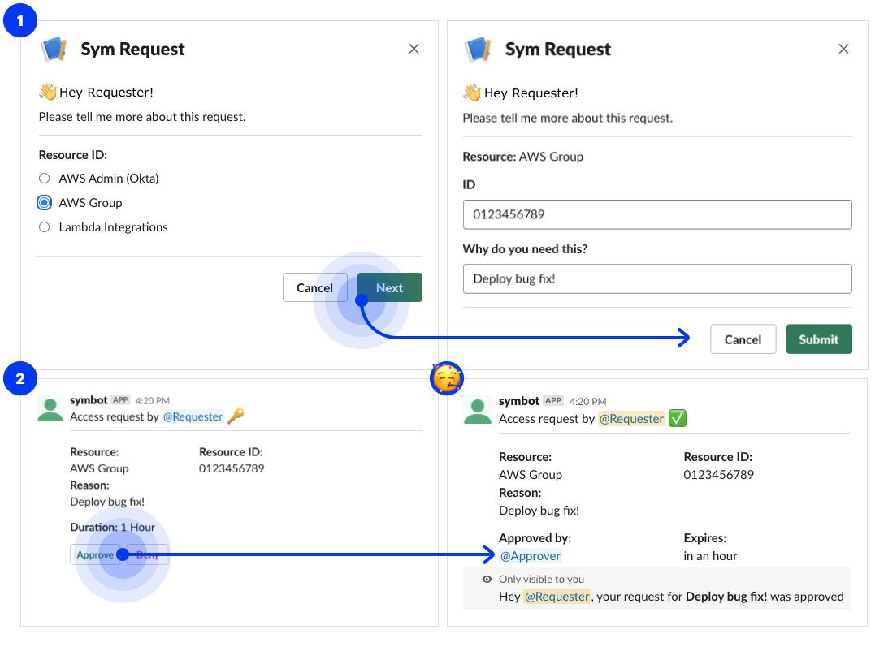

# Using the Workflow

Here's what your hard work brought the team:

Anyone on your team can initiate a request with `/access-request` in Slack now and get the request modal \(1\). Then, someone in the Slack channel `#my-team-access-requests` will approve your request \(2\).

Once approved, access is automatically granted. In this case, it automatically expires in an hour. 

### Congrats 🎉

Your team was waiting too long to fix a customer issue because of data access, or access was wide open. With a few lines of Terraform, Python, and the Sym Platform, you've deployed a Workflow for granting temporary access to data and infrastructure.


Goal: configure a Workflow for granting temporary data and infrastructure access with approval from your teammates through Slack ✅


