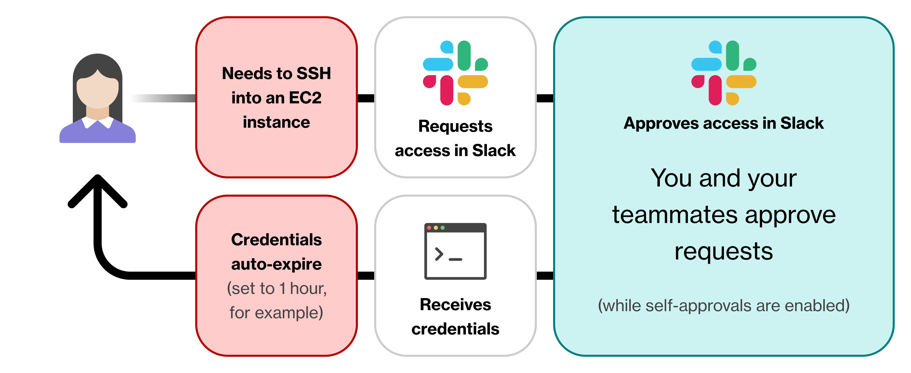

# What is a Workflow?

Sym Workflows connect the technologies you already use to bring security and privacy policies to life. Workflows automate the steps of these policies to make life quicker and easier for engineers.

Each Workflow comes from a [Template](templates/) that defines the flow's base behavior like requesting access to a sensitive resource. Templates have key steps for customization through Sym's [Python SDK](python-sdk/) where all of the technologies your organization uses are brought together.

Workflows are first created by somebody at the organization \(often on the Security or DevOps team\), and then used by many. 

For instance, a security engineer might want to protect access to SSHing into sensitive EC2 instances. They would use the Access Template and Python SDK to set up a peer-approval process. Once launched, the engineering team could request access in Slack, receive approval from teammates, and receive temporary SSH access to an EC2 instance.

